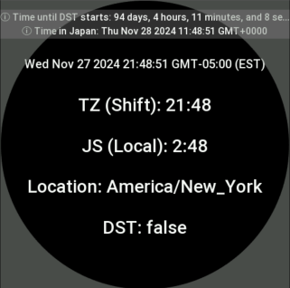
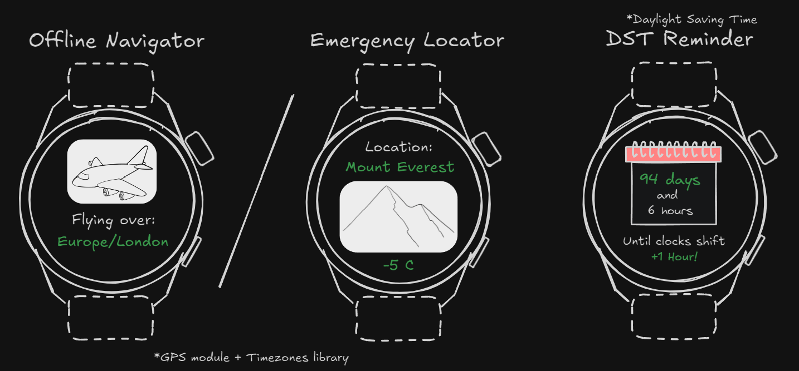

## Timezones for ZeppOS
`Timezones` - An extended version of `QuickJS's` built-in `new Date()` object that properly handles Daylight Saving Time (DST) changes. 
- Handles timezone conversions, DST calculations, and location-based time information. 
- Supports IANA timezone identifiers, UTC offsets, and provides methods for getting current time, converting between timezones, and determining DST status. 
- Uses a built-in timezone database that is suited to work fully offline.
- Allows simple modification & simulation of actual time and date.
  


--- 

### Installation
To install the library, run the following command from the root of your project
```bash
npm i @silver-zepp/timezones
```

### Download example (optional)
The library contains an example suited to run on `Balance` watch/emulator.
* modify `app.json` if you want to run this example on other watches

To use the library, clone this repo and run these commands from the root of the `/examples/timezones-example` folder.
```bash
npm install
zeus dev
```

--- 

### Using the library
```js
// install -> npm i @silver-zepp/timezones
import { Timezones } from "@silver-zepp/timezones";

// sets your tz instance to UTC -4 or -5 depending on Daylight Saving Time (DST)
const tz = new Timezones("America/New_York");
// by country abbriviation
const tz = new Timezones("CA"); // Canada
// or keep the built-in timezone but still be able to use benefits of the library
const tz = new Timezones();

// create a valid Date object that is shifted towards your specific timezone
// equivalent to const date = new Date();
const date = tz.getDate();
const cur_hour = date.getHours();
const cur_ms = date.getMilliseconds();
// ...
console.log(date);      // Tue Nov 26 2024 23:26:24 GMT-05:00 (EST)
console.log(cur_hour);  // 0-23

// alternatively you can get current HH/MM/SS without explicit date object creation
const cur_hour = tz.getSeconds(); // 0-59

// get current location and DST status
const { location, is_dst } = tz.getLocationAndDaylightStatus();
console.log(location, is_dst); // output: "America/New_York" false
```

--- 

### Simple apps that can be implemented using this library
<br>

--- 

### Bonus methods
#### Print approximate location based on GPS coordinates
```js
const london = { lat: 51.5072, lon: 0.1276 };
let approximate_location = tz.getApproxLocation(london.lat, london.lon);
console.log("GPS Approximate location:", approximate_location);
// output: GPS Approximate location: Europe/London
```
##### Use cases
* can be used in combination with `built-in watch's GPS` sensor to create a basic Geolocator
  * allows wearers to approximate their position, such as identifying the city they're flying over even in `Airplane mode` (no internet or Wi-Fi)
* can serve as an emergency location estimator in extreme scenarios like remote crash landings (as depicted in the 2023 film ["Society of the Snow"](https://www.imdb.com/title/tt16277242/))
  * while rare, this capability could be crucial in isolated or "dead-zone" areas

--- 

#### Print when will the next DST change happen
```js
// return a next dst change object that represents the time until the next DST change
console.log(JSON.stringify(tz.getTimeUntilNextDstChange()));
// output: 
{
  "next_change":"2025-03-02T02:00:00.000Z",
  "time_until_change":8213891000,
  "change_to_dst":true
}

// pretty print the date for the next DST on/off change
console.log(tz.formatTimeUntilNextDstChange());
// output: 
Time until DST starts: 95 days, 1 hours, 38 minutes, and 11 seconds 
```

##### Use cases
* can be used to create a simple app that counts time until `Summer/Winter` or a reminder to adjust the clocks that don't have internet

--- 

#### Set a Simulated Date
- Sets a simulated current date for testing purposes or time travel :)
```js
// 4H 1M before NY DST OFF (doesn't accoutn for current TZ shift)
Timezones.SetCurrentDate(new Date('2024-11-03T01:59:00Z')); 
```

--- 

#### Convert Local Time to Other Timezone Time
```js
// convert current (NY) time to Tokyo time
console.log("Time in Japan:", tz.convertToTimeZone(tz_date, 'Asia/Tokyo'));
// output: 
Time in Japan: Wed Nov 27 2024 14:21:48 // +14 hours to NY
```

--- 

#### Print related info regardless of a particular timezone
```js
const tz_info = tz.getTimezoneInfo("US");
vis.log(JSON.stringify(tz_info));
// output: 
{
  "code":"US",
  "tz_id":"America/New_York",
  "utc_sdt":"-05:00",
  "utc_dst":"-04:00",
  "tz_sdt":"EST",
  "tz_dst":"EDT",
  "continent":"northamerica",
  "lat":40.7127,
  "lon":-74.006,
  "dst_rule":"B13"
} 
```

#### DST rule (dst_rule) HEX encoding explained
- Handles both northern and southern hemisphere DST rules.
- Considers DST changes occurring at 2 AM.
- Handles the "last" week of the month when N is 0 in `nthWeekdayOfMonth()`.
- Example for NY `"dst_rule: B13"` -> `B13` (hex) = `1011 0001 0011` (bin)<br>
  start month: 3 (March)<br>
  start week: 2 (Second week)<br>
  end month: 11 (November)<br>
  end week: 1 (First week)<br>
- Output: New York (+ most of the US) where DST starts on the second Sunday in March and ends on the first Sunday in November.
```
+-------+-------+-------+-------+-------+
| Bits  | 15-12 | 11-8  |  7-4  |  3-0  |
+-------+-------+-------+-------+-------+
| Desc  | End   | End   | Start | Start |
|       | Week  | Month | Week  | Month |
+-------+-------+-------+-------+-------+
| Value |  1011 | 0001  | 0011  | 0011  |
|       |  (0)  | (11)  |  (1)  |  (3)  |
+-------+-------+-------+-------+-------+
```

--- 

## More about the library

This library works with `ZeppOS V2` and up!

### Supported Constructor Formats
```js
// empty constructor = use hardware/emulator built-in TZ
const tz = new Timezones(); 
// hour shifts in different formats
const tz = new Timezones(-4);       // int
const tz = new Timezones("-5");     // str int
const tz = new Timezones("+04:30"); // str
// valid / slightly misspelled IANA format
// WrongCountry/WrongCity | Europe/London | Europe/WarZaw
const tz = new Timezones("America/New_York");
// (str) "CA" // country abbriviation for Canada
const tz = new Timezones("CA");
// (str) SDT | DST (lookup)
const tz = new Timezones("CST");
```

### Cache clearing
If the location changes quickly or something doesn't look right, try changing the cache.
```js
tz.clearCache();
```

### Other methods
```js
const is_dst = tz.getDaylightStatus('America/New_York');
console.log(is_dst); 
// output: true (during DST period)

const { location, is_dst } = tz.getLocationAndDaylightStatus();
console.log(location, is_dst); 
// output: "America/New_York" true

const cur_time = tz.getTime();
console.log(cur_time); 
// output: ISO string -> "2024-10-10T14:30:00.000-04:00"
```

